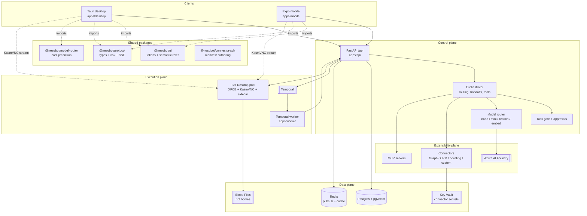
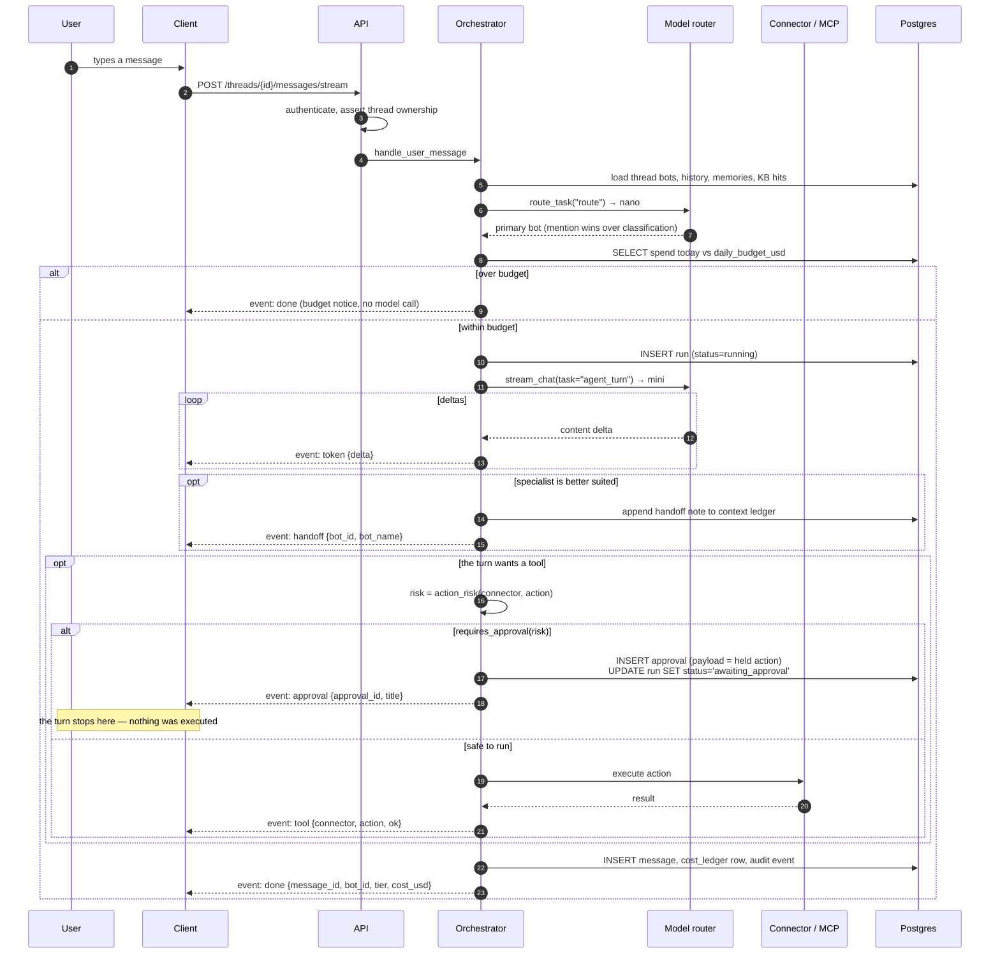
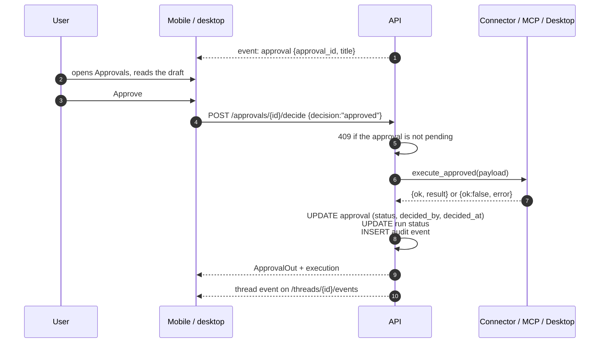
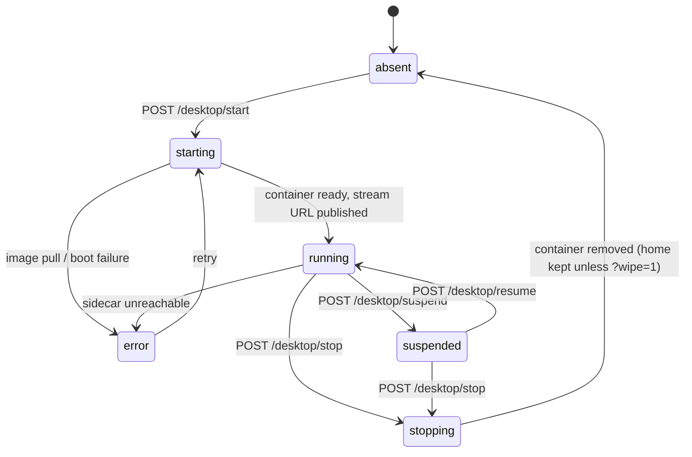
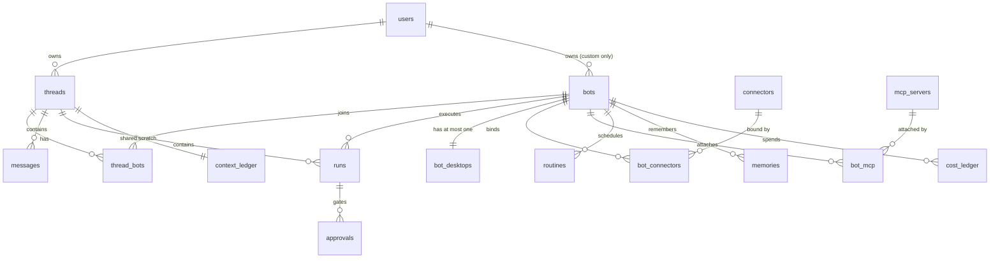

# Architecture

Nesq Bot is an internal team of always-on AI teammates. Each bot has a role, a
budget, a set of tools, and — when it needs one — its own Linux desktop. The
system is built so that a bot can do real work unsupervised while never being
able to do anything irreversible without a human saying yes.

Four planes:

| Plane             | What it owns                                             | Where it lives                                                                     |
| ----------------- | -------------------------------------------------------- | ---------------------------------------------------------------------------------- |
| **Control**       | Auth, orchestration, risk gating, approvals, budgets     | `apps/api` (FastAPI)                                                               |
| **Data**          | Threads, runs, memories, KB, audit, cost ledger, secrets | Postgres + pgvector, Redis, Blob/Files, Key Vault                                  |
| **Execution**     | Durable runs, scheduled routines, Bot Desktop containers | `apps/worker` (Temporal), `infra/bot-desktop`                                      |
| **Extensibility** | Connectors and MCP servers                               | `packages/connector-sdk`, `apps/api/app/services/connectors.py`, `mcp_registry.py` |

The clients (`apps/desktop`, `apps/mobile`) are thin: they render state, stream
tokens, and collect approval decisions. No governance logic lives in a client —
a client that lies cannot make the API do anything it would otherwise refuse.

## Components

## A chat turn

The interesting path is the streaming turn, because that is where routing,
tools, risk and cost all meet.

### Two event channels

The same turn is observable over two SSE endpoints, and they carry different
events on purpose:

|                                           | `POST /threads/{id}/messages/stream` | `GET /threads/{id}/events`              |
| ----------------------------------------- | ------------------------------------ | --------------------------------------- |
| Who                                       | the client that sent the message     | anyone else watching the thread         |
| `token`                                   | yes, one per delta                   | **no**                                  |
| `turn_started`                            | no — you started it                  | **yes**, drives the typing indicator    |
| `done`                                    | yes                                  | yes, and it carries the full final text |
| `handoff` / `tool` / `approval` / `error` | yes                                  | yes                                     |

`token` is withheld from the passive channel deliberately: a per-character
Redis publish is real load for no benefit to a second viewer. That viewer gets
`turn_started` to show that something is happening and the finished text on
`done`.

In TypeScript these are two separate unions — `TurnStreamEvent` and
`ThreadEvent` in `@nesqbot/protocol` — precisely so a handler written for one
cannot silently be pointed at the other. Both carry an `unknown` arm, so an
event added by a newer API degrades to a frame the client ignores rather than a
crash.

### The approval detour

When a turn parks on an approval, the run does not fail and the work is not
lost. The action is serialised into `Approval.payload` as one of four shapes
(`connector_action`, `mcp_tool`, `desktop_steps`, `message_only` — see
`ApprovalPayload` in `@nesqbot/protocol`) and the run sits in
`awaiting_approval`.

Rejection follows the same path minus the execution: status becomes
`rejected`, the run closes, and the audit row records who said no. Unattended
approvals are swept to `expired` via `POST /approvals/{id}/expire`.

## Bot Desktop lifecycle

Some work has no API. For that a bot gets a disposable Linux desktop — Debian
with XFCE (or IceWM for the lighter profile), KasmVNC for the stream, and an
HTTP sidecar that exposes `/health`, `/screenshot`, `/windows` and `/action`.

Three backends, chosen by `BOT_DESKTOP_MODE`:

- `mock` — no container. State transitions and a synthetic screenshot. This is
  the default in `docker-compose.yml` and what you develop against.
- `docker` — a local container per bot, home directory bind-mounted from
  `./data/bot-homes/{bot_id}`.
- `aks` — the API records `starting`, the worker creates the pod from
  `infra/bot-desktop/k8s/desktop-template.yaml`, and updates state when ready.

Every desktop action is risk-classified before it runs. Actions classified
`send`, `spend` or `delete` create an approval instead of executing, exactly
like a connector action — a bot cannot escape governance by driving a GUI.

Bot homes are persistent across restarts so a bot keeps its logins and files;
`POST /desktop/stop?wipe=1` is the escape hatch and is itself `delete`-class.

## Model routing and budgets

There is no flagship model in the hot path. Routing is by task class, not by
bot, and the table lives in `apps/api/app/services/model_router.py` with a
mirror in `@nesqbot/model-router` so clients can price a turn without a round
trip.

| Task class                     | Tier                                   | Default deployment       | $/1M in | $/1M out |
| ------------------------------ | -------------------------------------- | ------------------------ | ------- | -------- |
| `classify`, `route`, `compact` | `nano`                                 | `gpt-5.6-luna`           | 0.20    | 1.20     |
| `agent_turn`                   | `mini`                                 | `gpt-5.4-mini`           | 0.75    | 4.50     |
| `deep_plan`                    | `reason`                               | `gpt-5.6-sol`            | 5.00    | 30.00    |
| `computer_use_recover`         | `mini`, then `reason` after 2 failures |                          |         |          |
| `embed`                        | `embed`                                | `text-embedding-3-small` | 0.02    | 0        |

Every completion writes a `cost_ledger` row. Before each turn the orchestrator
sums today's spend for the bot and compares it to `daily_budget_usd`. At or
over budget the bot answers with a budget notice and makes no model call — a
**soft** cap: in-flight work finishes, nothing is killed mid-turn. Raise it
with `PATCH /bots/{bot_id}/budget`.

Escalation to `reason` is deliberately rare: deep planning, and desktop
automation that has already failed twice. It is also expensive — `gpt-5.6-sol`
costs about 6.7x `gpt-5.4-mini` per token in both directions, so an escalation
is worth roughly seven ordinary turns. If you find yourself wanting the
reasoning tier for a normal turn, the prompt or the tool is the problem.

## Data model

All tables live in one Postgres database; `pgvector` backs memory and KB
search. Definitions: `apps/api/app/models.py`, DDL in `apps/api/sql/init.sql`.

Groups worth knowing:

- **Conversation** — `threads`, `thread_bots`, `messages`, `context_ledger`.
  A thread can contain several bots; `context_ledger` is the shared scratch
  space they hand between each other on a handoff.
- **Execution** — `runs` (one bot turn or routine execution), `approvals`
  (held actions), `audit_events` (append-only, never updated).
- **Capability** — `connectors` (catalog), `bot_connectors` (binding +
  `secret_ref`), `mcp_servers`, `bot_mcp`, `routines`.
- **Knowledge** — `memories` (per bot and user, embedded), `kb_articles`
  (org-wide, embedded). Both fall back to keyword search when Azure embeddings
  are unconfigured.
- **Money** — `cost_ledger`, one row per completion, plus `daily_budget_usd`
  on the bot.

Ownership is by column, not by row-level security: `threads.owner_user_id`,
`bots.owner_user_id` (null for system bots), `mcp_servers.owner_user_id`. See
`security.md` for what that does and does not currently guarantee.

## Related documents

- `API.md` — the binding HTTP contract. It wins over anything written here.
- `bots.md` — bot definitions and the five system bots.
- `connectors.md` — manifests, risk, secret binding, authoring.
- `security.md` — auth, risk model, secrets, tenancy, known gaps.
- `local-dev.md` — running the four processes locally.
- `deploy.md` — Azure topology and the production checklist.
